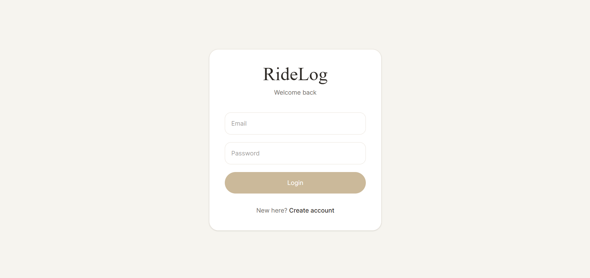
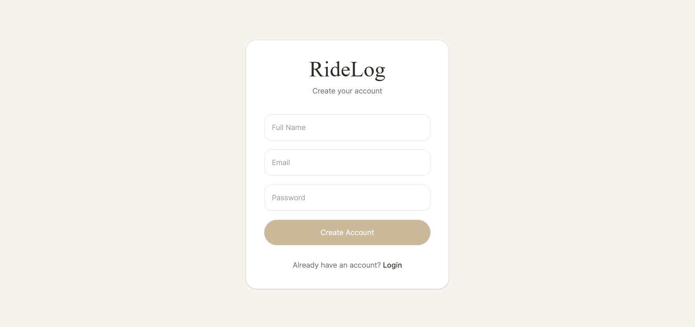
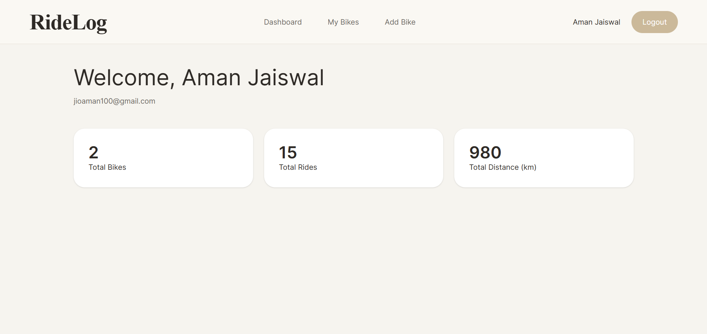
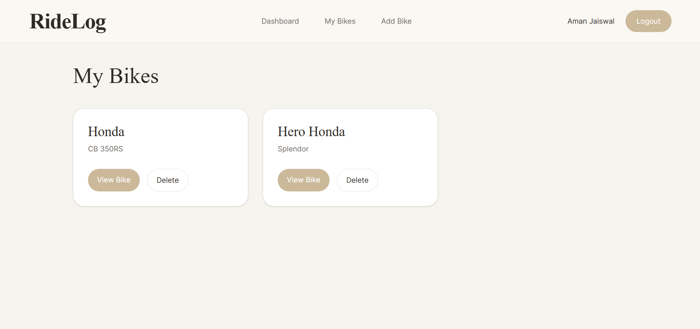
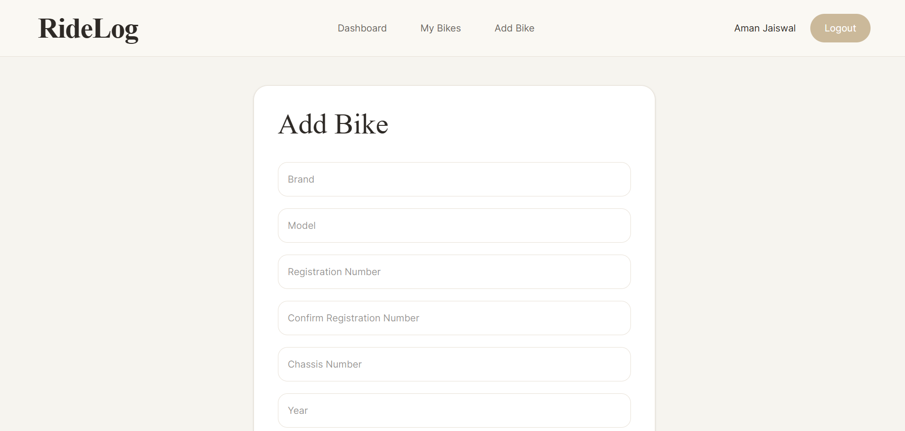
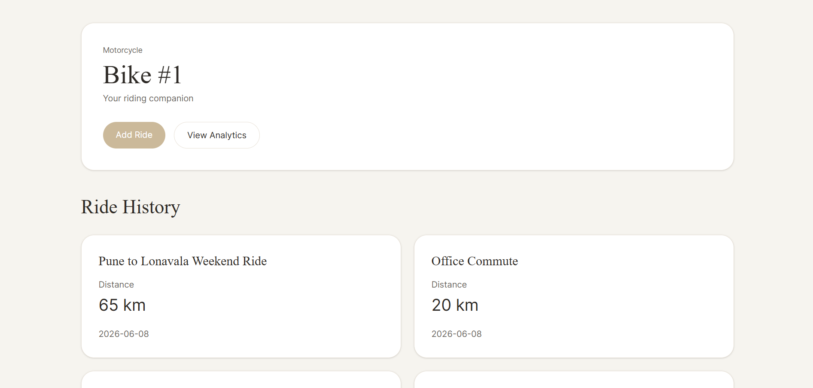
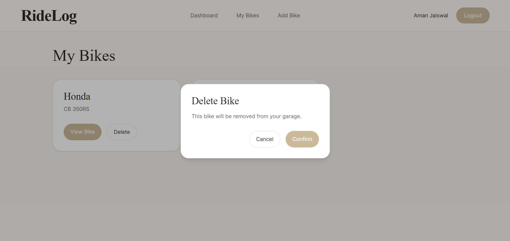

#  RideLog

RideLog is a full-stack motorcycle ride tracking platform built using a microservices architecture. Riders can manage motorcycles, log rides, and analyze riding statistics through a modern React frontend.

##  Features

### Authentication

* User registration and login
* JWT-based authentication
* Protected routes and secured APIs

### Bike Management

* Add motorcycles
* View owned motorcycles
* Delete motorcycles
* Manage multiple bikes under a single account

### Ride Management

* Log rides for motorcycles
* Track ride distances
* Maintain ride history
* View bike-specific ride records

### Analytics

* Total bikes owned
* Total rides completed
* Total distance traveled
* Average ride distance
* Longest ride
* Bike-specific ride analytics

### User Experience

* Premium luxury-inspired UI
* Responsive design
* Toast notifications
* Custom confirmation modals
* Empty and loading states

---

##  Architecture

```text
React Frontend
       │
       ▼
   API Gateway
    │      │
    ▼      ▼
RideService  AnalyticsService
      │
      ▼
   PostgreSQL
```

### Services

#### API Gateway

Routes requests from the frontend to backend services and handles CORS configuration.

#### Ride Service

Responsible for:

* Authentication
* User Management
* Bike Management
* Ride Management

#### Analytics Service

Responsible for:

* User Analytics
* Bike Analytics
* Aggregated Ride Statistics

---

##  Tech Stack

### Frontend

* React
* React Router
* Axios
* Tailwind CSS

### Backend

* Java 17+
* Spring Boot
* Spring Security
* Spring Data JPA
* Spring Cloud Gateway
* OpenFeign

### Database

* PostgreSQL

### DevOps

* Docker

---

##  Screenshots

### Login



### Register



### Dashboard



### Bikes Page



### Add Bike



### Bike Overview



### Delete Confirmation



---

##  Running Locally

### Clone Repository

```bash
git clone https://github.com/exeaman/Ride-Log.git
cd Ride-Log
```

### Create Databases

```sql
CREATE DATABASE ridelog_ride_db;
CREATE DATABASE ridelog_analytics_db;
```

### Start Services

Run services in the following order:

1. RideService
2. AnalyticsService
3. ApiGateway
4. Frontend

---

##  Docker

Build Ride Service:

```bash
docker build -t rideservice .
```

Run Ride Service:

```bash
docker run -p 8081:8081 rideservice
```

Similar Dockerfiles are provided for all backend services.

---

##  Authentication

RideLog uses JWT authentication.

Protected endpoints require:

```http
Authorization: Bearer <jwt-token>
```

---

##  API Documentation

Swagger UI is available for backend services.

### Ride Service

```text
http://localhost:8081/swagger-ui/index.html
```

### Analytics Service

```text
http://localhost:8082/swagger-ui/index.html
```

---

##  Future Improvements

* Ownership validation for analytics endpoints
* GPS route visualization
* Fuel tracking
* Maintenance tracking
* Cloud deployment
* CI/CD pipeline

---

##  Author

Aman Jaiswal

Built to learn and demonstrate:

* Spring Boot Microservices
* React Frontend Development
* JWT Authentication
* PostgreSQL
* Docker
* API Gateway Architecture
